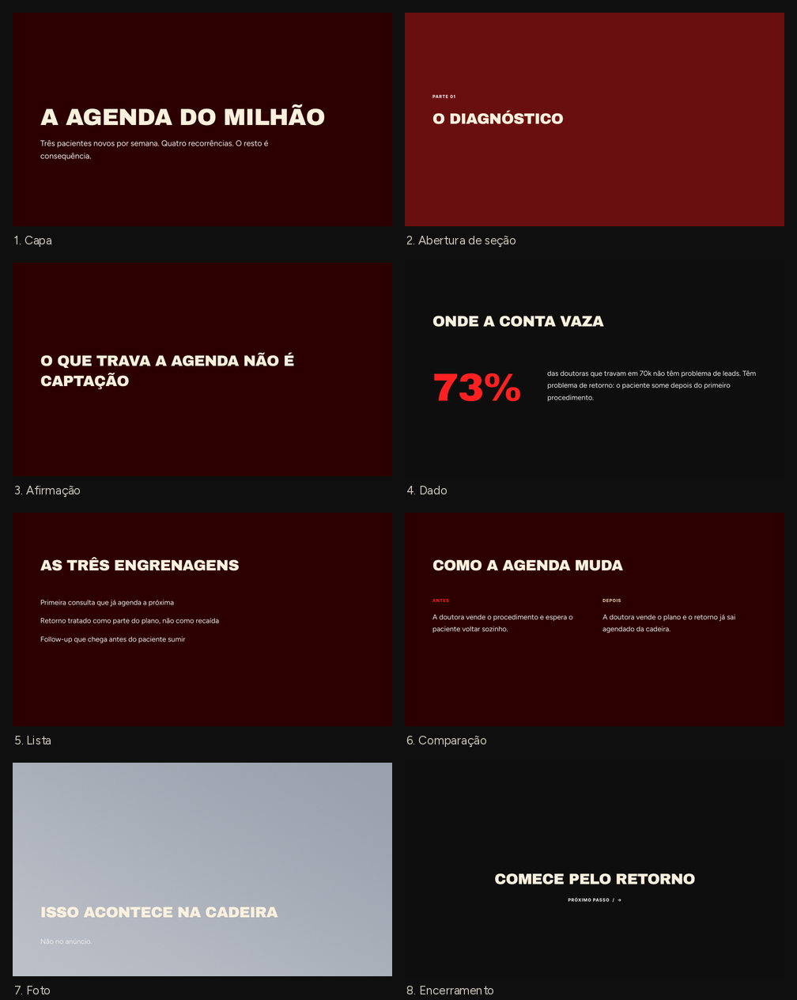

# Design System RECONECTA

Um lugar só pra identidade da marca. As apresentações do time são feitas no
**Google Apresentações** — sem instalar nada, sem baixar nada.



---

## Se você só quer fazer uma apresentação

1. Abra o modelo: **[COLE AQUI O LINK DO DRIVE]**
2. **Arquivo → Fazer uma cópia**
3. Escreva.

Só isso. Nada de instalar fonte, nada de clonar repositório. As fontes da marca
são do catálogo do Google, então o Apresentações já sabe desenhar elas sozinho.

> **Não edite o modelo original.** Faça a cópia primeiro — ela é sua, o original
> é do time.

### A regra que faz tudo funcionar

> **Você não escolhe cor nem fonte. Escolhe o tipo de slide e digita o texto.**

Pra trocar o tipo de um slide: **Slide → Aplicar layout**.

| Se você quer... | Use o layout |
|---|---|
| abrir a apresentação | **Capa** |
| avisar que começou uma parte nova | **Abertura de seção** |
| uma frase sozinha na tela, pra pesar | **Afirmação** |
| um número grande e o que ele significa | **Dado** |
| listar 3 ou 4 coisas curtas | **Lista** |
| antes e depois lado a lado | **Comparação** |
| imagem grande com título por cima | **Foto** |
| fechar com a única coisa que fica | **Encerramento** |
| algo que não se encaixa em nada acima | **Livre** |

A cópia já vem com um slide de exemplo de cada um. Olhe, entenda, apague os que
não for usar.

### Quando algo dá errado

**O texto não cabe.** Não diminua a fonte — corte a copy. Se não couber mesmo,
vira dois slides.

**Quero destacar uma palavra.** Use cor, nunca itálico nem peso mais fino. E só
um vermelho por slide: dois destaques na mesma tela se cancelam.

**Quero mudar uma cor do modelo.** Não mude no slide. Cor e regra da marca só
mudam em `core/tokens.json`, e aí valem pra tudo. Fala com quem cuida do sistema.

---

## Setup (uma vez só, por quem administra)

O `.pptx` deste repositório é a **fonte**; o arquivo no Drive é a **cópia viva**
que o time usa.

1. Baixe `design-system/pptx/RECONECTA-modelo.pptx`
2. Arraste pro Drive, numa pasta compartilhada com o time
3. Botão direito no arquivo → **Abrir com → Google Apresentações**
4. **Arquivo → Salvar como Apresentações Google** (isso cria a versão nativa)
5. Compartilhe a pasta com o time como **Leitor** — leitor consegue fazer cópia,
   e assim ninguém edita o original sem querer
6. Cole o link lá em cima, no começo deste README, e no guia visual

### A conversão foi verificada

Importado e conferido no Google Apresentações em **18/ago/2026**. Passou nos
seis pontos:

- [x] Títulos em **CAIXA ALTA**
- [x] Títulos em **Archivo Black**
- [x] Corpo em **Figtree**
- [x] Os 9 layouts aparecem em **Slide → Aplicar layout**, com nome em português
- [x] O `73%` do slide Dado está vermelho
- [x] Fundo bordô correto

**Refaça essa conferência sempre que regerar o `.pptx`** — a conversão é boa, mas
não é garantida entre versões.

### Quando mudar o modelo

Regerar o `.pptx` a partir dos tokens:

```bash
./.venv-ds/bin/python design-system/pptx/build_potx.py
```

Depois repita o setup acima (passos 1 a 4) pra atualizar a cópia do Drive.
Cor, tamanho e regra nova entram no `core/tokens.json` — nunca no gerador,
nunca direto num slide.

---

## E quem usa PowerPoint ou Keynote?

Funciona também, mas aí as fontes precisam estar instaladas na máquina:

```bash
bash design-system/instalar-fontes.sh
```

Depois feche e reabra o programa. **Isso não é necessário pro Google
Apresentações** — lá as fontes vêm do servidor do Google.

---

## As duas pistas de tipografia

| | Display | Corpo | Rótulo |
|---|---|---|---|
| **licenciada** — o que a gente renderiza (carrossel, PDF) | Dx Monstral | Grift | Inter |
| **google** — o que o time edita (Apresentações) | Archivo Black | Figtree | Inter |

Mesmas cores, mesma escala, mesmos layouts nas duas. Archivo Black e Figtree
foram escolhidas medindo largura contra as reais: o Archivo tem o mesmo desenho
do Dx Monstral e o Figtree fica a 2% da largura do Grift.

As Google são OFL e estão neste repositório. As licenciadas são comerciais e
**não podem ser redistribuídas**.

---

## Estrutura

```
design-system/
├── core/tokens.json        ← a fonte de verdade. Mudou aqui, muda em tudo.
├── pptx/build_potx.py      ← gera o modelo lendo os tokens (zero cor hardcoded)
├── pptx/RECONECTA-modelo.pptx  ← a fonte do arquivo que vai pro Drive
├── pptx/preview.png        ← a imagem lá de cima
├── fontes/google/          ← as OFL + licenças (só pra PowerPoint/Keynote local)
└── instalar-fontes.sh      ← idem
```
